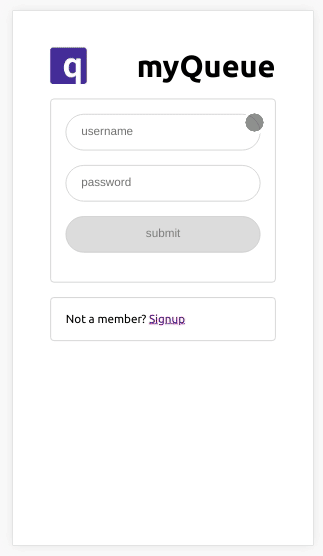
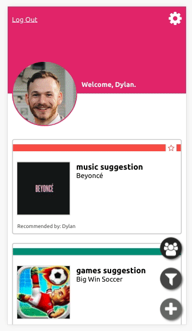
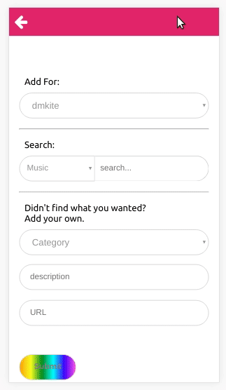
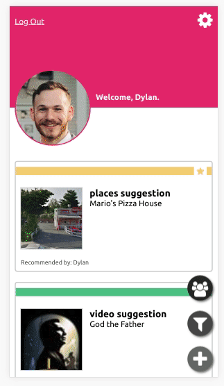

# My Queue
Recommend cool things to your friends! 

This repo contains both a Back-End and Front-End React application to recommend links 
for friends to checkout or build a list for yourself. News Articles? Music? Books? Whatever! 

## Screenshots

## To get started 
1. Clone down the repo and navigate to each sub-directory (`backend` and `my-app`) and run `npm i`
2. `createdb my_queue_dev`
3. Backend:
..1. `npm run knex migrate:latest`
..2.`npm run knex seed:run`
..3. Start up Backend with `npm run dev`
4. Frontend (my-app):
..1. `npm start`

### Dev Notes
On the backend we used a .env file that looked like:  
`SECRET=someformoflongtexthere`
`CLOUDINARY_URL=cloudinary://....`

On the front env we had a .env.development that looked like:  
`REACT_APP_BASE_URL=https://localhost:8080`

## Created Using 

### Turnkey
Skip the set up - jump into the fun stuff!
(https://github.com/dmkite/react-turnkey)
